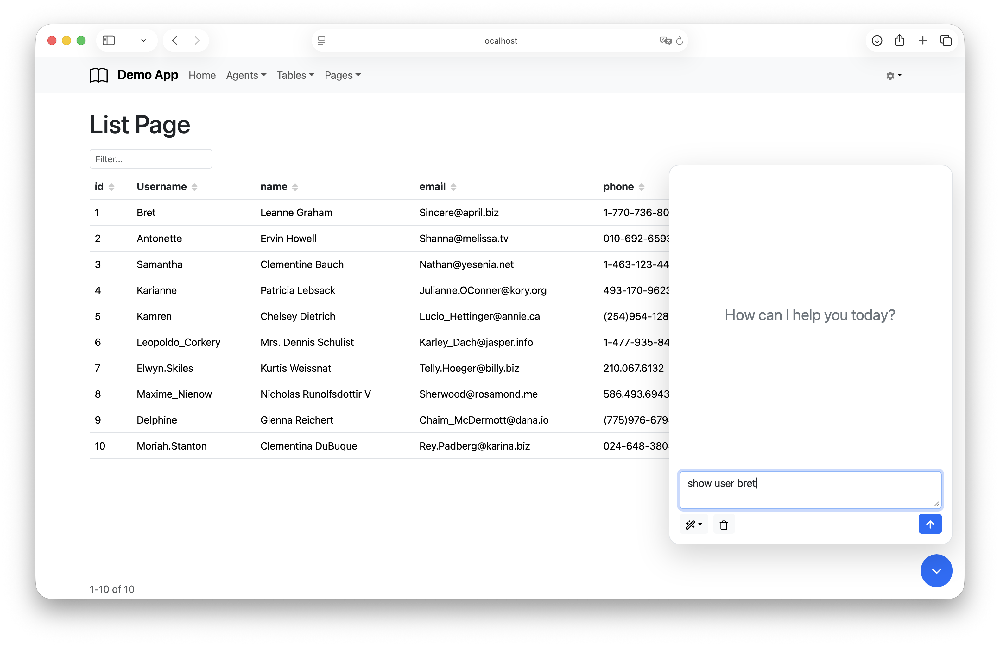
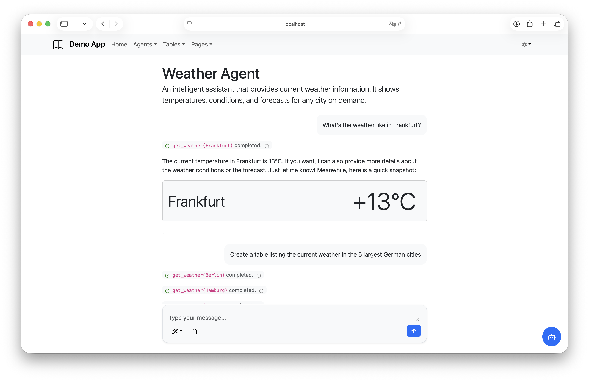

# react-qui — Quick UI for Enterprise Apps

[](https://www.typescriptlang.org/)
[](LICENSE)

**qui** (quick UI) is a React component library for building enterprise application UIs. Built on React-Bootstrap, React Router, and React Hook Form, it delivers production-ready building blocks for role-based routing, master-detail pages, paginated table management, and async data loading — so you ship features instead of plumbing.




---

## Packages

| Package | Description |
|---------|-------------|
| [`@greenstones/qui-core`](packages/qui-core) | Base layer — auth context, data hooks, column/field builders, modal stack, filter/sort utilities. No styling opinions. |
| [`@greenstones/qui-bootstrap`](packages/qui-bootstrap) | Bootstrap 5 UI layer — form fields, tables, pages, app layouts, modals, and CRUD action hooks built on top of `qui-core`. |
| [`@greenstones/qui-supabase`](packages/qui-supabase) | Supabase integration — typed repository pattern, paginated table hooks, auth provider, and Edge Function invocation. |
| [`@greenstones/qui-ai`](packages/qui-ai) | AI chat layer — chat UI components (page, panel, messages), session management, markdown rendering, chart widgets, and model hooks. Supports Anthropic, OpenAI, and AWS Bedrock via the AI SDK. |

---

## Getting Started

### 1. Install packages

```bash
npm install @greenstones/qui-core @greenstones/qui-bootstrap @greenstones/qui-ai \
  react react-dom react-bootstrap react-router-dom react-hook-form \
  bootstrap lucide-react \
  @ai-sdk/openai @openai/agents @openai/agents-extensions
```

### 2. Bootstrap your app

Import Bootstrap CSS and wrap your app with a router:

```tsx
// main.tsx
import "bootstrap/dist/css/bootstrap.min.css";
import { StrictMode } from "react";
import { createRoot } from "react-dom/client";
import { App } from "./App";

createRoot(document.getElementById("root")!).render(
  <StrictMode>
    <App />
  </StrictMode>,
);
```

```tsx
// App.tsx
import { BootstrapApp, NavLink } from "@greenstones/qui-bootstrap";
import { Nav } from "react-bootstrap";
import { BrowserRouter, Route } from "react-router-dom";
import { UsersListPage } from "./UsersListPage";

export function App() {
  return (
    <BrowserRouter>
      <BootstrapApp
        projectName="My App"
        topnav={
          <Nav>
            <NavLink to="/users" text="Users" />
          </Nav>
        }
        publicRoutes={
          <>
            <Route path="/users" element={<UsersListPage />} />
          </>
        }
      />
    </BrowserRouter>
  );
}
```

### 3. Create a list page with an AI assistant

Define an agent and wire it to the page using `AssistantButton`:

```tsx
// agent.ts
import { createOpenAI } from "@ai-sdk/openai";
import { LocalSession } from "@greenstones/qui-ai";
import { Agent } from "@openai/agents";
import { aisdk } from "@openai/agents-extensions/ai-sdk";

const openai = createOpenAI({ apiKey: import.meta.env.VITE_OPENAI_API_KEY });

export const agentSession = new LocalSession("my-app-agent");

export const agent = new Agent({
  name: "App Assistant",
  instructions: "You help users understand the data on screen.",
  model: aisdk(openai("gpt-4.1-mini")),
  tools: [],
});
```

```tsx
// UsersListPage.tsx
import { AssistantButton, useChat } from "@greenstones/qui-ai";
import { ListPage } from "@greenstones/qui-bootstrap";
import { Filters, Sorters, useArray, useColumnBuilder, useFetch } from "@greenstones/qui-core";
import { agent, agentSession } from "./agent";

interface User {
  id: number;
  name: string;
  username: string;
  email: string;
  phone: string;
}

export function UsersListPage() {
  const { data } = useFetch<User[]>("https://jsonplaceholder.typicode.com/users");

  const list = useArray(data, {
    filter: Filters.objectContains(),
    sorter: Sorters.objectProps(),
  });

  const columns = useColumnBuilder<User>((b) =>
    b.column("id").column("name").column("username").column("email").column("phone"),
  );

  const chat = useChat({ agent, session: agentSession });

  return (
    <>
      <ListPage header="Users" list={list} columns={columns} />
      <AssistantButton chat={chat} />
    </>
  );
}
```

The `AssistantButton` renders a floating button that opens a chat panel. The agent has access to the full AI SDK tool-calling API — pass `tools` to your `Agent` to let it query data, call APIs, or render charts.

---

## Contributing

1. Fork and clone the repo
2. `bun install` from the root
3. Work inside the relevant `packages/` or `apps/` directory
4. Run `bun run build` in the package you changed to verify types compile
5. Test visually with Storybook (`bun run storybook`) or the demo apps
6. Open a PR against `main`

There is no automated test suite — component behaviour is verified through Storybook stories and the demo apps.

---

## License

MIT
